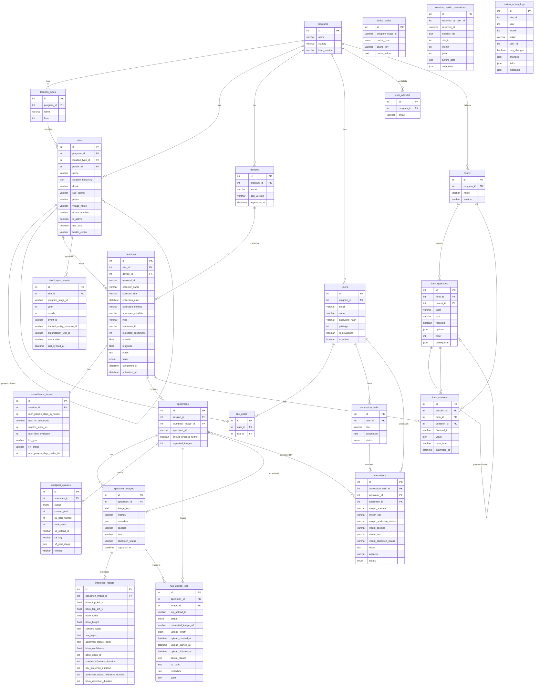

# VectorCam API — Database Schema

MySQL database with Sequelize ORM. 23 tables organized across 6 domains.

## Entity Relationship Diagram



## Table Hierarchy

```
programs
├── location_types              (hierarchy levels, e.g. district / parish / village)
├── sites                       (self-referencing tree via parent_id; typed by location_type)
│   ├── site_users              (user access junction)
│   └── dhis2_sync_events       (monthly DHIS2 sync records)
├── devices                     (mobile collection devices)
├── users                       (auth + role)
│   ├── site_users              (access control)
│   └── annotation_tasks        (batch annotation work)
│       └── annotations         (per-specimen labels)
├── user_whitelist              (registration allowlist)
└── forms                       (survey form definitions)
    └── form_questions          (self-referencing tree via parent_id)

sessions                        (belongs to site + device)
├── surveillance_forms          (1:1 household demographics)
├── specimens                   (1:N mosquito specimens)
│   ├── specimen_images         (1:N images per specimen)
│   │   └── inference_results   (1:1 ML model output)
│   ├── multipart_uploads       (S3 chunked upload state)
│   ├── tus_upload_logs         (TUS protocol upload tracking)
│   └── annotations             (quality labels from annotators)
└── form_answers                (survey responses, linked to form + question)
```

## Domain Summary

| Domain                 | Tables                                                                                      | Description                                             |
| ---------------------- | ------------------------------------------------------------------------------------------- | ------------------------------------------------------- |
| **Organization**       | `programs`, `location_types`, `sites`                                                       | Top-level hierarchy; sites form a tree within a program |
| **Users & Access**     | `users`, `site_users`, `user_whitelist`                                                     | Auth, roles, per-site permissions                       |
| **Data Collection**    | `devices`, `sessions`, `surveillance_forms`                                                 | Field collection sessions at sites                      |
| **Specimens**          | `specimens`, `specimen_images`, `inference_results`, `multipart_uploads`, `tus_upload_logs` | Mosquito images and ML inference pipeline               |
| **Forms**              | `forms`, `form_questions`, `form_answers`                                                   | Configurable survey questions and responses             |
| **Annotation & Audit** | `annotation_tasks`, `annotations`, `session_conflict_resolutions`, `review_action_logs`     | QA workflow and audit trail                             |
| **DHIS2 Integration**  | `dhis2_sync_events`, `dhis2_cache`                                                          | External health system sync                             |

## Key Enums

| Table               | Column       | Values                                                                  |
| ------------------- | ------------ | ----------------------------------------------------------------------- |
| `sessions`          | `state`      | `NEEDS_REVIEW`, `IN_REVIEW`, `CERTIFIED`, `SUBMITTED`, `NOT_APPLICABLE` |
| `multipart_uploads` | `status`     | `pending`, `in_progress`, `completed`, `failed`                         |
| `tus_upload_logs`   | `status`     | `created`, `in_progress`, `completed`, `failed`                         |
| `annotation_tasks`  | `status`     | `PENDING`, `IN_PROGRESS`, `COMPLETED`                                   |
| `annotations`       | `status`     | `PENDING`, `ANNOTATED`, `FLAGGED`                                       |
| `dhis2_cache`       | `cache_type` | `orgUnit`, `tei`, `dataElementMap`                                      |
